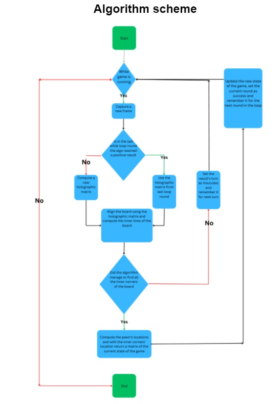
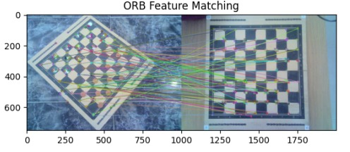
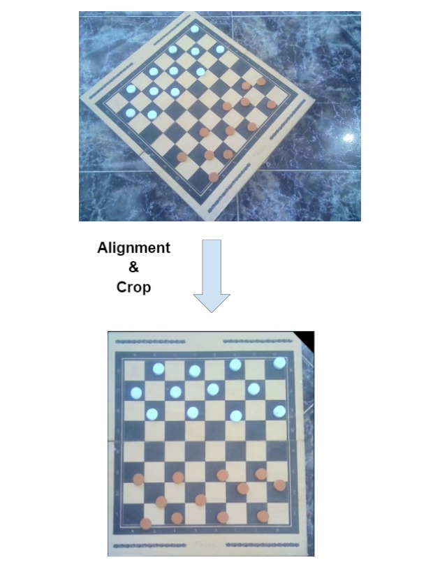
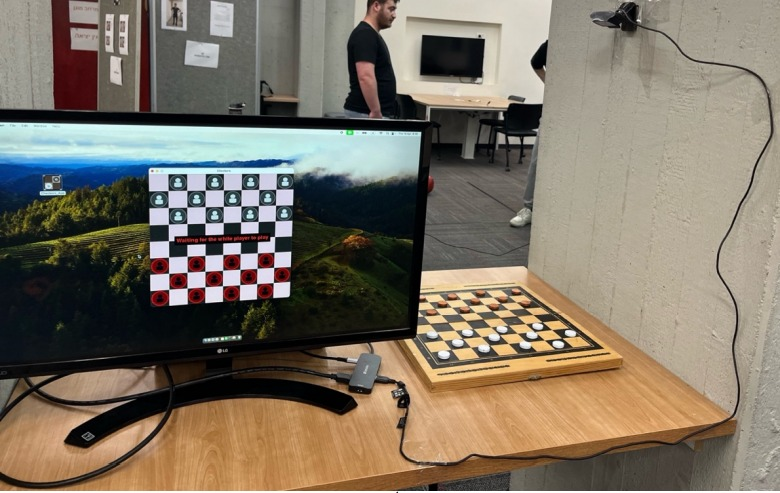

# Interactive checkers game

In this project we developed a real-time single webcam video application translating a checkers game into a digital interactive version.
To apply this application, the user should take in advance a reference picture of the board in an aligned position.
During the game, the camera can be positioned in a wide range of angles and distances.

The image processing core of the game is described in the following flow chart:

Shortly and abtractly described, we aim to find an homographic transformation to align the board. We first find keypoints in the current frame and the reference picture using ORB:

We then find the homographic transformation by computing Least Squares with RANSAC on the matched keypoints:

Next, we use Hough lines to find the board inner corners and Hough circles to find the pawns. Using HSV color space we differentiate both sides' pawns:

Finally, we convert the locations we found into a binary matrix representing the game state which we embed into the digital version:

